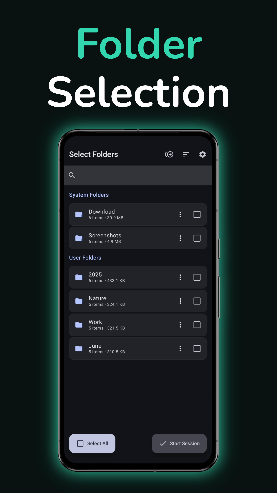
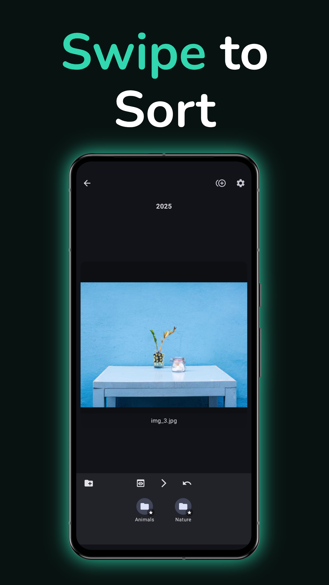
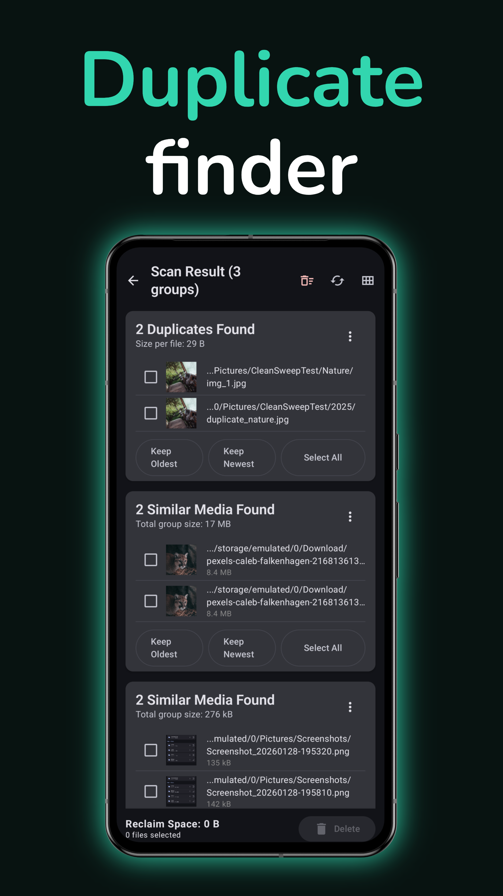
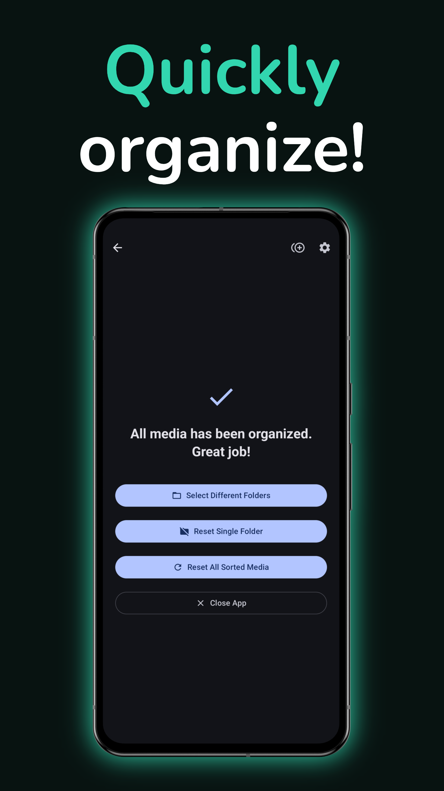

# CleanSweep

**Tired of a cluttered photo gallery? Get organized with a swipe!**

CleanSweep is a powerful and private application for Android that helps you reclaim storage space and organize your photos and videos with a fun, simple, Tinder-like interface. Swipe right to keep, swipe left to delete. It's that easy.

Best of all, **CleanSweep is 100% offline.** Your files and your data never leave your device, ensuring your memories remain private.

## Key Features

CleanSweep is packed with smart features to make media management a breeze.

### The Fun & Easy Way to Organize
*   ✨ **Intuitive Swiping:** Quickly sort through thousands of files. Swipe right to keep, left to delete.
*   📁 **One-Tap Sorting:** Add your favorite folders, and they'll appear at the bottom of the screen. Simply tap a folder icon to instantly move the current photo or video.
*   ✂️ **Clip Video Moments:** Turn a favorite moment from a video into a still image with the built-in frame extractor.

### A Tailor-Made Experience

CleanSweep is built on the belief that your tools should work *your* way. The app features a comprehensive settings menu that lets you fine-tune nearly every aspect of the experience to match your personal workflow.

*   ⚙️ **Deep Customization:** From changing swipe sensitivity and theming to controlling how folder names are displayed, you have the power to create your perfect setup.
*   🧠 **Smart Defaults:** While highly configurable, the app comes with sensible defaults so you can be productive right out of the box.
*   👆 **Your Workflow, Your Rules:** Adjust everything from video playback speed to confirmation dialogs and default folder selections to make CleanSweep truly your own.

### Powerful Duplicate Finder
Free up gigabytes of space by getting rid of unnecessary copies.
*   🔎 **Finds Exact & Similar Media:** CleanSweep detects files that are 100% identical, as well as photos and videos that look visually similar (like burst shots or trimmed clips).
*   🎛️ **You Control the Similarity:** Choose your desired level of "sameness" (Strict, Balanced, or Loose) to fine-tune the scan and get the results you want.
*   🗑️ **Smart Deletion:** Tools like "Keep Oldest" or "Keep Newest" let you clean up entire groups of duplicates with a single tap.

### Smart and Fast Performance
*   ⚡ **Finds *All* Your Media:** CleanSweep performs a deep scan to find media files that other apps might miss, ensuring nothing is overlooked.
*   🚀 **Optimized for Speed:** By smartly caching information, future scans become significantly faster. The app is designed to get you organizing without the wait.
*   ⚫ **AMOLED-Friendly:** A sleek, true-black dark mode that looks great on any screen.

## Privacy First
We take your privacy seriously. CleanSweep is designed from the ground up to respect your data:
*   **Completely Offline:** The app works without any internet connection.
*   **No Tracking or Analytics:** We don't collect any data on how you use the app.
*   **Your Files Stay Yours:** Your photos and videos are never uploaded or shared. All processing happens securely on your device.

## Gallery

  
  &nbsp;
  

  
  &nbsp;
  

*Note: AMOLED theme has a slightly different look on purpose!*

## Getting Started

1.  **Requirements:** You'll need a device running **Android 10 or newer**.
2.  **Installation:** Download the latest release from the [Releases page](https://github.com/LoopOtto/cleansweep/releases).
3.  **Onboarding:** The first time you open CleanSweep, a helpful tutorial will walk you through all the features and gestures.

## Permissions Explained
CleanSweep needs certain permissions to manage your files. Here’s a simple breakdown of why each one is necessary:

| Permission Needed | Why We Need It |
| :--- | :--- |
| **All Files Access** | This is the core permission. It allows CleanSweep to find, move, and delete your photos and videos, no matter where they are stored on your device. |
| **Notifications** | To show you the progress of long-running tasks, like a duplicate scan, even when the app is in the background. |

## For Developers

### Technologies Used
CleanSweep is built with a modern Android development approach, leveraging the following key technologies and libraries:

*   **Language:** Kotlin
*   **UI Toolkit:** Jetpack Compose with Material 3
*   **Dependency Injection:** Hilt
*   **Local Database:** Room Persistence Library (for caching file signatures and scan results)
*   **Image Loading:** Coil
*   **Media Playback:** ExoPlayer (Media3)
*   **Asynchronous Storage:** DataStore Preferences
*   **Background Processing:** WorkManager

### Contributing
We welcome contributions of all kinds, from bug reports to feature requests, code improvements and translations!

To ensure a smooth and collaborative process, please read our **[Contributing Guidelines](CONTRIBUTING.md)** before you start. This document outlines our development workflow, coding standards, and how to submit your changes.

**Note:** Feature requests from project supporters, such as donors and contributors, will be prioritized.

## Donating
If you enjoy using CleanSweep and want to support its development, check out our **[Funding Page](FUNDING.md)** for crypto donation options.

## License

Copyright (c) 2025 LoopOtto.

This project is licensed under the GNU General Public License v3.0. See the [LICENSE](LICENSE) file for the full license text.
